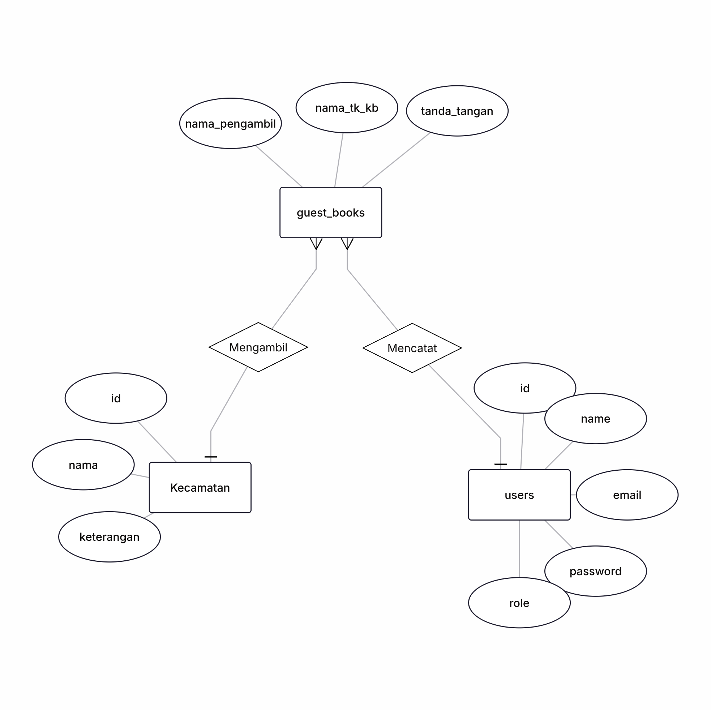
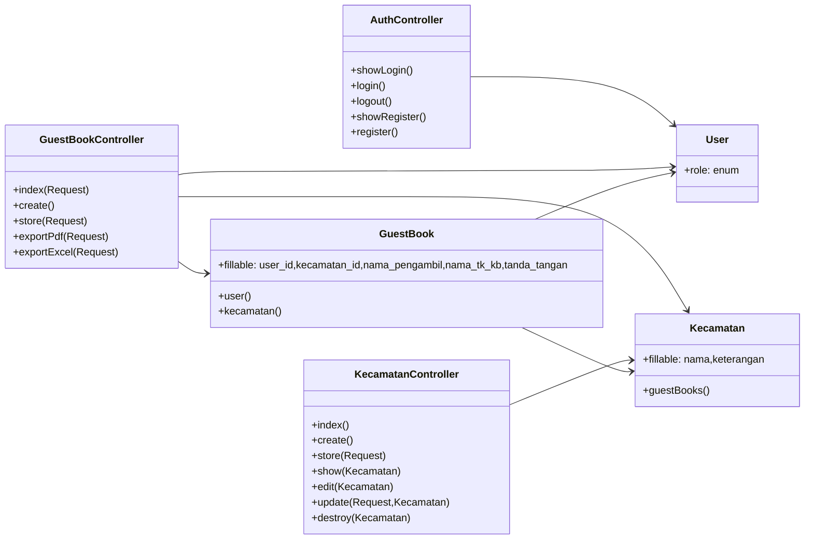

# Buku Tamu Digital Dinas Pendidikan

Aplikasi buku tamu digital berbasis Laravel 12 untuk Dinas Pendidikan Kabupaten Garut (dapat diganti sesuai kebutuhan). Sistem ini menggantikan buku manual dengan formulir daring yang dilengkapi tanda tangan digital, pencarian data real-time, ekspor arsip, serta modul administrasi kecamatan.

## Gambaran Umum Web
- **Tujuan**: mengelola kedatangan jemput dokumen TK/KB di lingkungan dinas, termasuk bukti tanda tangan dan asal kecamatan.
- **Peran Pengguna**: admin/operator (akses penuh) dan user (akses baca/input). Role diverifikasi melalui middleware `Admin`.
- **Keluaran**: tabel buku tamu responsif, pratinjau tanda tangan (modal), eksport HTML/PDF dan CSV, serta statistik per kecamatan.
- **Tech stack**: Laravel 12 (PHP 8.2), MySQL, Bootstrap 5 + Font Awesome + Google Fonts, Signature Pad (canvas), Vite untuk aset opsional.

## Modul & Fitur Utama
### 1. Buku Tamu Digital
- Form input dengan dropdown kecamatan, nama pengambil, nama TK/KB, dan tanda tangan canvas (Signature Pad lengkap dengan undo/reset).
- Validasi sisi server, notifikasi sukses, dan penyimpanan base64 pada kolom `tanda_tangan`.
- Daftar data dengan filter kecamatan, nama pengambil, dan nama TK/KB; paginasi 10 entri per halaman; pratinjau tanda tangan via modal.

### 2. Administrasi Kecamatan
- CRUD kecamatan untuk admin: tambah, edit, hapus, dan detail kecamatan beserta daftar buku tamu terkait.
- Ringkasan jumlah buku tamu per kecamatan pada tabel manajemen.

### 3. Autentikasi
- Login, logout, dan registrasi bawaan Laravel dengan validasi pesan lokal.
- Middleware `auth` menjaga seluruh modul, sedangkan `guest` menjaga halaman login/register.
- Seeder menyiapkan dua akun admin: `admin@dinpendidikan.go.id` (admin123) dan `operator@dinpendidikan.go.id` (operator123).

### 4. Ekspor & Pelaporan
- Ekspor HTML siap cetak (dapat dibuka di browser lalu "Print to PDF").
- Ekspor CSV untuk Excel/Spreadsheet dengan header: No, Kecamatan, Nama Pengambil, Nama TK/KB, Tanggal.
- Terdapat filters reuse pada tautan ekspor, sehingga laporan mengikuti kriteria yang sedang aktif.

## Dokumentasi Pengguna & Alur Kerja
### Alur operasional singkat
1. Pengguna mendaftar atau menggunakan akun bawaan, kemudian login.
2. Admin menyiapkan daftar kecamatan melalui menu `Kecamatan`.
3. Operator membuka `Buku Tamu → Input` dan mengisi formulir bersama pemohon.
4. Data otomatis muncul pada daftar buku tamu lengkap dengan filter dan nomor urut.
5. Saat dibutuhkan, operator mengekspor laporan atau memperlihatkan tanda tangan sebagai bukti.

### Rute Penting
| Method | Endpoint | Deskripsi | Middleware |
|--------|----------|-----------|------------|
| GET    | `/login`, `/register` | Menampilkan form autentikasi | `guest`
| POST   | `/login`, `/register` | Proses autentikasi/registrasi | `guest`
| POST   | `/logout` | Keluar sesi | `auth`
| GET    | `/guest-books` | Daftar buku tamu + filter | `auth`
| GET    | `/guest-books/create` | Form input buku tamu | `auth`
| POST   | `/guest-books` | Simpan data buku tamu | `auth`
| GET    | `/guest-books/export/pdf` | Ekspor HTML/PDF | `auth`
| GET    | `/guest-books/export/excel` | Ekspor CSV | `auth`
| GET    | `/kecamatan` | Daftar kecamatan | `auth`
| GET    | `/kecamatan/{id}` | Detail kecamatan | `auth`
| GET    | `/kecamatan/create|edit` | Form admin | `auth` + `admin`
| POST   | `/kecamatan` | Tambah kecamatan | `auth` + `admin`
| PUT    | `/kecamatan/{id}` | Perbarui kecamatan | `auth` + `admin`
| DELETE | `/kecamatan/{id}` | Hapus kecamatan | `auth` + `admin`

### Hak akses ringkas
| Peran | Hak | Catatan |
|-------|-----|---------|
| Admin | Semua fitur (`GuestBook` & `Kecamatan`) + manajemen pengguna via seeder | Role = `admin`
| User  | Baca & input buku tamu | Tidak dapat CRUD kecamatan

## Instalasi & Menjalankan Proyek
1. **Persyaratan**: PHP 8.2+, Composer, MySQL 5.7+, Node 18+ (untuk Vite), dan ekstensi GD/BCMath.
2. **Clone & dependency**
   ```bash
   git clone <repo-url>
   cd Buku-Tamu-Disdik
   composer install
   npm install   # opsional bila ingin menjalankan Vite
   ```
3. **Konfigurasi environment**
   ```bash
   cp .env.example .env
   php artisan key:generate
   ```
   Sesuaikan koneksi database:
   ```dotenv
   DB_CONNECTION=mysql
   DB_HOST=127.0.0.1
   DB_PORT=3306
   DB_DATABASE=buku_tamu
   DB_USERNAME=root
   DB_PASSWORD=secret
   ```
4. **Migrasi & seeding**
   ```bash
   php artisan migrate --seed
   ```
   Perintah di atas membuat tabel `users`, `kecamatan`, `guest_books`, serta mengisi data kecamatan dan dua akun admin.
5. **Menjalankan aplikasi**
   ```bash
   php artisan serve
   # opsional: npm run dev untuk hot reload
   ```
6. **Akun bawaan**
   - Admin: `admin@dinpendidikan.go.id` / `admin123`
   - Operator: `operator@dinpendidikan.go.id` / `operator123`

## Struktur Direktori Singkat
```
app/
├── Http/
│   ├── Controllers/ (AuthController, GuestBookController, KecamatanController)
│   └── Middleware/ (Admin, Authenticate, Guest)
├── Models/ (GuestBook, Kecamatan, User)
├── Helpers/GuestBookHelper.php
resources/
├── views/
│   ├── guest-books/ (index, create)
│   ├── kecamatan/ (index, show, create, edit)
│   ├── auth/ (login, register)
│   └── layouts/app.blade.php
routes/web.php
```

## Diagram & Arsitektur
### Entity Relationship Diagram (ERD)

If you prefer a rendered image, place `erdplus.png` at the repository root and it will be displayed below.



### UML Class Diagram (Ringkas)


### Skema Database (detail kolom utama)
#### Tabel `users`
| Kolom | Tipe | Keterangan |
|-------|------|-----------|
| `id` | bigint PK | Auto increment |
| `name` | varchar(255) | Nama lengkap |
| `email` | varchar(255) unique | Digunakan untuk login |
| `password` | varchar(255) | Password tersimpan hash |
| `role` | enum(`admin`,`user`) | Menentukan hak akses |
| `remember_token`, `email_verified_at`, timestamps | bawaan Laravel |

#### Tabel `kecamatan`
| Kolom | Tipe | Keterangan |
|-------|------|-----------|
| `id` | bigint PK |
| `nama` | varchar(255) unique | Nama kecamatan |
| `keterangan` | text nullable | Deskripsi tambahan |
| `created_at`, `updated_at` | timestamps |

#### Tabel `guest_books`
| Kolom | Tipe | Keterangan |
|-------|------|-----------|
| `id` | bigint PK |
| `user_id` | bigint FK → `users.id` (set null on delete) | Pencatat |
| `kecamatan_id` | bigint FK → `kecamatan.id` (set null on delete) | Lokasi asal |
| `nama_pengambil` | varchar(255) | Orang yang mengambil dokumen |
| `nama_tk_kb` | varchar(255) | Nama lembaga |
| `tanda_tangan` | longtext | Data URL base64 Signature Pad |
| `created_at`, `updated_at` | timestamps |
| `kecamatan` | varchar(255) | Kolom legacy untuk kompatibilitas, masih diisi oleh factory |

## Pengujian & Kualitas
- Jalankan `php artisan test` untuk memastikan fitur dasar tetap aman.
- Gunakan factory `GuestBookFactory` bila memerlukan data dummy (`php artisan tinker` atau `php artisan db:seed --class=GuestBookSeeder`).

## Penyesuaian Lain
- **Daftar kecamatan statis**: dapat diubah melalui `app/Helpers/GuestBookHelper.php` bila ingin menyajikan dropdown tanpa query database.
- **Tampilan**: semua warna utama berada di `resources/views/layouts/app.blade.php`, selaras dengan tema biru lembut pemerintah.
- **Ekspor**: saat ini menghasilkan HTML & CSV sederhana; integrasi PDF library (DomPDF/Snappy) dapat ditambahkan di `GuestBookController` jika dibutuhkan.

Selamat menggunakan aplikasi Buku Tamu Digital! Jika menemukan kendala atau ingin menambahkan modul baru, buat issue/pull request di repository ini.
